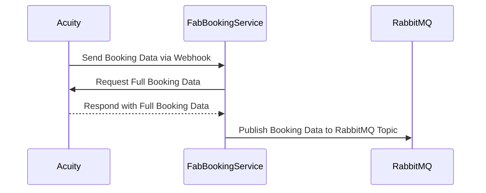

# fab-acuity-mq

A Node.js service for managing Acuity bookings, built with Docker support for seamless deployment in both development and production environments.



---

## Prerequisites

Ensure the following are installed on your system:

- **Docker** (version 20.10 or higher)
- **Docker Compose** (version 1.29 or higher)
- **Environment Variables**: Prepare the required access keys listed below.

---

## Environment Variables

Before running the application, create a `.env.development` and `.env.production` file to store the required environment variables. Below are the keys and their descriptions:

| Key                  | Description                                                                 |
|----------------------|-----------------------------------------------------------------------------|
| `PORT`              | The port the application will listen on (e.g., `3000`)                     |
| `MONGO_URI`         | MongoDB connection URI                                                     |
| `RABBITMQ_URI`      | RabbitMQ connection URI                                                    |
| `RABBITMQ_EXCHANGE` | The RabbitMQ exchange name                                                 |
| `RABBITMQ_QUEUE`    | The RabbitMQ queue name                                                    |
| `ACUITY_USER_ID`    | The Acuity user ID for external API integration                            |
| `ACUITY_API_KEY`    | The Acuity API key for external API integration                            |

---

## Building and Running the Application Locally with Docker

### 1. **Clone the Repository**
```bash
git clone https://github.com/yourusername/fab-booking-service.git
cd fab-booking-service
```

### 2. **Prepare Environment Files**
Create two `.env` files in the root directory:

- **`.env.development`** for development mode:
  ```env
  PORT=3001
  MONGO_URI=mongodb://localhost:27017/dev-db
  RABBITMQ_URI=amqp://localhost
  RABBITMQ_EXCHANGE=dev-exchange
  RABBITMQ_QUEUE=dev-queue
  ACUITY_USER_ID=your-acuity-user-id
  ACUITY_API_KEY=your-acuity-api-key
  ```

- **`.env.production`** for production mode:
  ```env
  PORT=3000
  MONGO_URI=mongodb://production-db-host:27017/prod-db
  RABBITMQ_URI=amqp://production-rabbitmq-host
  RABBITMQ_EXCHANGE=prod-exchange
  RABBITMQ_QUEUE=prod-queue
  ACUITY_USER_ID=your-acuity-user-id
  ACUITY_API_KEY=your-acuity-api-key
  ```

### 3. **Build the Docker Image**

To build the Docker image locally:
```bash
docker build -t fab-booking-service .
```

### 4. **Run in Development Mode**

To run the application in development mode with Docker Compose:
```bash
docker-compose up development
```

- The application will be accessible on `http://localhost:3001`.
- Hot-reloading will be enabled via volume mounting.

### 5. **Run in Production Mode**

To run the application in production mode with Docker Compose:
```bash
docker-compose up production
```

- The application will be accessible on `http://localhost:3000`.

---

## Health Check

The service includes a healthcheck endpoint:

- **Development**: `http://localhost:3001/health`
- **Production**: `http://localhost:3000/health`

Docker will monitor the service's health automatically.

---

## Debugging and Logs

To view logs from the container, run:
```bash
docker logs <container_name>
```

For real-time logs:
```bash
docker logs -f <container_name>
```

---

## Stopping the Application

To stop the application, use:
```bash
docker-compose down
```

This will stop and remove all running containers and networks created by Docker Compose.

---

## Troubleshooting

- Ensure the `.env` files are correctly populated and accessible to Docker.
- If MongoDB, RabbitMQ, or other external services are unreachable, verify their URIs and ensure they are running.

---
